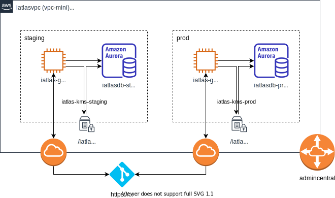

# Overview

Infrastructure to support the iAtlas project

## Design

These resources are created by sceptre:
config/common includes the vpc and network attachments for the project. Also launches the GitLab runner instance.
config/staging launches an aurora postgresql resource, kms key, and the api app for the staging environment.
config/prod launches an aurora postgresql resource, kms key, and the api app for the production environment.

![alt text][architecture]

## Setup

### Secrets

For the API to access the database the following secrets must be created in the [AWS Secrets Manager](https://aws.amazon.com/secrets-manager/)

- `iatlas_gitlab_registry_creds`

  with values for:
  - `username`
  - `password`

  These are readonly credentials for accessing the container registry in GitLab. The username and password (deploy token) are generated in [GitLab](https://gitlab.com/groups/cri-iatlas/-/settings/repository#js-deploy-tokens)

### Manual Deploys

The following MUST be created initially for the CI/CD to work in GitLab:

- `staging/iatlas-runner.yaml`

  The `staging` GitLab runner is used for general and staging environment builds in GitLab. Creating it will also create:
  - `common/iatlasvpc.yaml`
  - `staging/iatlas-kms.yaml`
  - `staging/iatlas-api-db.yaml`

  The database instance is needed so that the host values may be passed to the GitLab Runner. The host is a subnet and not available outside the VPC.

  The KMS stack is needed for the Database.

  The VPC is needed for the Runner and the Database.

- `prod/iatlas-runner.yaml`

  The `prod` GitLab runner is used for prod environment builds in GitLab only. Creating it will also create:
  - `common/iatlasvpc.yaml`

    (this should already be created by the staging stack above)
  - `prod/iatlas-kms.yaml`
  - `prod/iatlas-api-db.yaml`

  The database instance is needed so that the host values may be passed to the GitLab Runner. The host is a subnet and not available outside the VPC.

  The KMS stack is needed for the Database.

  The VPC is needed for the Runner and the Database.

- `staging/iatlas-api-hostedzone.yaml`

- `prod/iatlas-api-hostedzone.yaml`

  Once the HostedZones are created for Staging and Production, NS records may be created in the domain registrar with values from the respective HostedZones.

  ie - If the domain staging.example.com is to be used for the Staging API, create an NS record for the `staging` subdomain in the domain registrar for each of the nameservers created in the HostedZone for that domain - [route53](https://console.aws.amazon.com/route53/v2/hostedzones#).

## Contributing

- Install [pre-commit](https://pre-commit.com/#install) app
- Clone this repo
- Run `pre-commit install` to install the git hook

## Test Deployment

[Install aws cli](https://docs.aws.amazon.com/cli/latest/userguide/install-cliv2.html)

Create credentials file in your local user folder. The file should be called `credentials` located in `~/.aws`.

The contents should look like:

```credentials
[iAtlas]
aws_access_key_id = {ACCESS_KEY}
aws_secret_access_key = {SECRET_ACCESS_KEY}
aws_session_token = {SESSION_TOKEN}
region = us-east-1
```

Create config file in your local user folder. The file should be called `config` located in `~/.aws`.

The contents should look like:

```config
[default]
region = us-east-1
```

Install [Python](https://www.python.org/)

See [https://packaging.python.org/guides/installing-using-pip-and-virtual-environments/](https://packaging.python.org/guides/installing-using-pip-and-virtual-environments/) for information on installing Python packages for a specific project.

## Architecture


